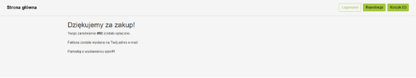

Jan Paluszkiewicz

155902

Projekt Aplikacje Internetowe

Temat: Sklep Internetowy – ,,*Gym Animals’’*

## 1. Krótki opis projektu

   Celem projektu było stworzenie sklepu internetowego „Gym Animals” z odzieżą sportową: użytkownicy mogą przeglądać, wyszukiwać i sortować produkty, wybierać rozmiary, zarządzać koszykiem oraz składać zamówienia z odbiorem w paczkomacie lub dostawą pod wskazany adres, a następnie dokonywać płatności i przeglądać historię zakupów. Dodatkowo po zakupie można wystawić opinię z oceną i zdjęciem jeżeli jest się użytkownikiem zalogowanym oraz przejrzeć swoja historię zamówień. System oferuje rejestrację, logowanie z JWT oraz reset hasła, a dla administratorów dostępny jest CRUD do zarządzania produktami, obsługi zamówień i moderacji recenzji. 

## 2. Wymagania funkcjonalne

1. **Przeglądanie produktów bez logowania**  
   Użytkownik może wejść na stronę i bez logowania wyświetlić wszystkie produkty wraz z ocenami.  
   System ma umożliwiać filtrowanie i sortowanie produktów według:
   - nazwy,
   - kategorii,
   - ceny.

2. **Szczegóły produktu bez logowania**  
   Użytkownik może wyświetlić szczegółowe informacje o produkcie, w tym:
   - nazwę i opis,
   - dostępne rozmiary i ilości do zamówienia,
   - listę komentarzy oraz średnią ocen.

3. **Zakup bez logowania**  
   Użytkownik może przejść przez cały proces zakupu, w tym wybór dostawy:
   - dostawa na adres lub do paczkomatu,
   - przy paczkomacie – wybór lokalizacji na mapie (symulowana interaktywna mapa + baza danych z punktami).

4. **Filtrowanie po kategoriach bez logowania**  
   Użytkownik może przeglądać produkty należące do określonych kategorii.

5. **Łączenie filtrów**  
   Mechanizmy filtrowania z punktów 1, 3 i 4 mogą być ze sobą łączone.

6. **Rejestracja i przypomnienie hasła**  
   Użytkownik może zarejestrować konto i skorzystać z funkcji przypomnienia hasła.

7. **Dodawanie produktów przez admina**  
   Zalogowany użytkownik (admin) może dodać nowy produkt, podając:
   - nazwę, opis, stan magazynowy,
   - kategorię produktu,
   - zdjęcie.

8. **Dodawanie opinii po zakupie**  
   Zalogowany użytkownik może po zakupie dodać opinię, która zawiera:
   - ocenę (liczbową – obowiązkowo),
   - komentarz (opcjonalnie),
   - zdjęcie (opcjonalnie).

9. **Edycja/Usuwanie opinii**  
   Zalogowany użytkownik może edytować lub usunąć własną opinię o produkcie.

10. **Zarządzanie produktami i opiniami przez admina**  
   Admin może:
   - edytować i usuwać produkty,
   - usuwać komentarze innych użytkowników.

11. **Wyszukiwanie opinii**  
   Użytkownik może wyszukiwać opinie:
   - na stronie konkretnego produktu,
   - według nazwy produktu (z użyciem pełnotekstowego indeksowania komentarzy).

## 3. Uruchomienie aplikacji

Do przechowywania moich danych używam XAMPP, żeby strona zadziałała należy go uruchomić, uruchamiając moduł Apache i MySQL, następnie przechodząc do zakładki Admin dla MySQL należy zaimportować bazę hoodie\_shop.sql podana w folderze zip. Używam Node.js wiec również trzeba go zainstalować. Mój projekt podzielony jest na Front-end (folder client) i Back-end (folder server), należy przejść do folderu hoodie\_shop/server oraz hoodie\_shop/client i w konsoli cmd wykonać najpierw polecenie **npm install**, a następnie **npm start**. Po tym serwer odpali się na localhost:5000, a klient na localhost:3000.

## 4. Dokładniejszy opis wszystkich funkcjonalności z ilustracjami
   4.1 Użytkownik niezalogowany – gość 

Niezalogowany użytkownik może przeglądać dostępne produkty. Może zobaczyć swój koszyk oraz się zalogować/zarejestrować.

Rejestracja klienta (w bazie stworzone są już 3 konta [email; hasło]: [klient1@ex.com; klient1], [klient2@ex.com; klient2],[admin@ex.com; admin]). 

Ekran logowania z opcja przypomnienia hasła (Uwaga: przypomnienie hasła działa tylko jeżeli podczas rejestracji podano prawdziwy mail, nie dodawałem weryfikacji maila ponieważ uznałem ze zbytnio skomplikuje to proces testowania aplikacji).

Tutaj używam konta z realnym mailem do przypomnienia hasła.

  

Mail dla przypomnienia hasła oraz strona do resetu hasła.

Użytkownik niezalogowany może przeczytać szczegółowe informacje o produkcie oraz opinie innych użytkowników (zalogowanych), a następnie wybrać rozmiar (jeżeli jest dostępny) i dodać do koszyka odpowiednia ilość (jeżeli jest dostępna)

Każdy użytkownik może zobaczyć swój koszyk i przejść cały proces zamawiania.

Podawany tutaj mail nie jest związany z kontem klienta jest to mail do ,,faktury’’. Warto więc podać tutaj realny mail ponieważ potwierdzenie zakupu z pseudo-faktura jest faktycznie wysyłane.

 

Użytkownik ustawia na mapie punkt odniesienia (znacznik), strona podpowiada mu najbliższe punkty odbioru (Niebieskie to dostępne, a czerwony wybrany. Oczywiście może wybrać dowolny, nawet w innym mieście : ) ). Opcja druga ,,Dostawa pod adres’’ to po prostu wpisanie ręcznie adresu dostawy. 

Po wyborze dostawy przechodzimy do podsumowania, w tym momencie (jeżeli stan magazynu nadal zgadza się z zamówieniem) po kliknięciu zapłać zamówienie jest rejestrowane, mail z potwierdzaniem wysyłany, a przedmioty usuwane z koszyka oraz z magazynu.

  

4.2 Użytkownik zalogowany

Po zalogowaniu odblokowuje się opcja *,,Moje zamówienia’’*, gdzie użytkownik może zobaczyć historię swoich zamówień oraz wejść w ich szczegóły.

Widoki odpowiednio historii zamówień i szczegółów zamówienia (po kliknięciu w link ID).

 

Dodatkowo użytkownik może edytować/usunąć swoja opinie o produkcie.

Może tez wystawić nowa opinie o produkcie, jeżeli jeszcze tego nie zrobił, a zakupił ten przedmiot. (Np. klient2 ma niewystawiona opinie na Koszulkę z chomikiem).

4.3 Admin

Admin może robić wszystko to co zwykły użytkownik z dodatkowymi funkcjonalnościami. Jego zakładka moje zamówienia zmienia się w Zamówienia gdzie widzi on wszystkie zamówienia użytkowników i nazwę użytkownika (mail) (pusta rubryka z kreską to niezalogowany użytkownik, ale po wejściu w szczegóły wyświetlają się normalnie jego dane kontaktowe). Admin może usuwać wszystkie komentarze nawet nie swoje. 

Dodatkowo admin ma dostęp do zakładki ,,Admin: produkty” gdzie może dodawać nowe produkty lub edytować istniejące. (ekran dodawania rozni się od edycji tylko tym ze na początku formularz jest cały pusty, najłatwiej działanie edycji jest sprawdzić na cenie) 

## 5. Co jeszcze chciałbym dodać

Aktualnie koszyk po wylogowaniu się jest usuwany w przyszłości chciałbym dodać opcje unieważniania się koszyka po jakimś czasie (np. po 30 min). W przesłanym projekcie nie zdążyłem jednak tego zaimplementować.
